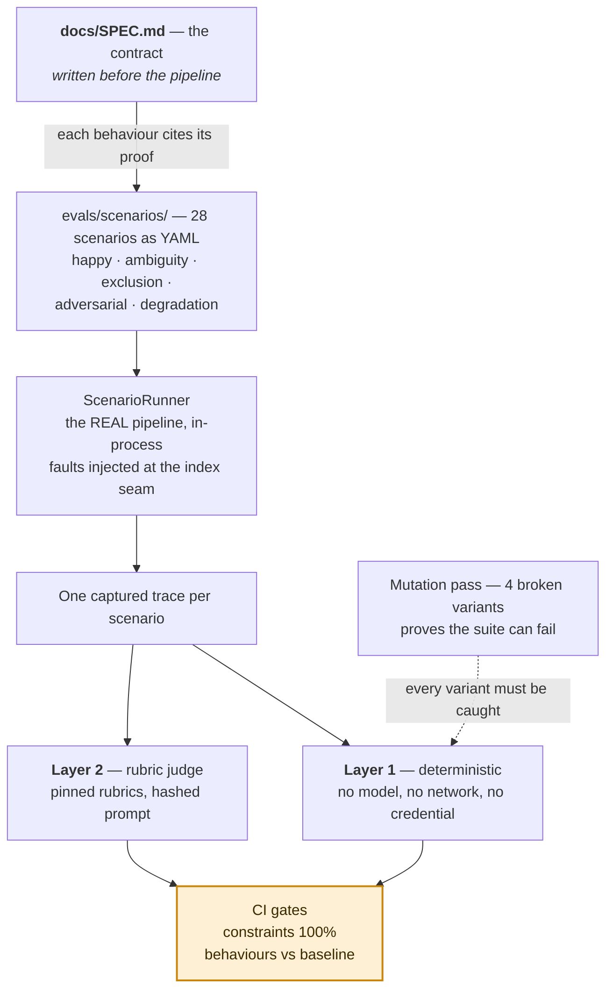
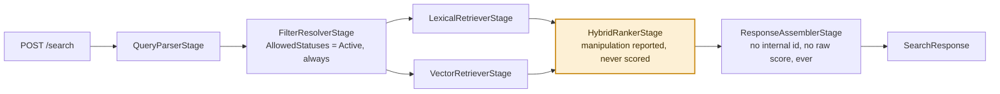

# listing-search-bench

[](LICENSE "License")
[](https://github.com/konradcinkusz/listing-search-bench/commits/main "Maintained")
[](https://konradcinkusz.github.io/listing-search-bench/ "Docs")

**A spec-first evaluation bench for a hybrid search and ranking service.** A
behaviour contract written before the pipeline existed, 28 scenarios stored as
data across five classes, and a Layer 1 harness that grades the *execution trace*
of a real hybrid retrieval pipeline — which candidates a lexical and a vector
retrieval path actually returned, how they were filtered and ranked, and what was
**never** a candidate at all — so a ranking-weight tune, a filter refactor, or a
listing trying to manipulate its own score fails a build instead of a customer.

It applies the same methodology as
[`agent-eval-bench`](https://github.com/konradcinkusz/agent-eval-bench) — my
reference implementation of the repository-agnostic
[AI evaluation standard](https://github.com/konradcinkusz/architecture-standards/blob/main/docs/guides/AI-EVALS.md) —
to a different measuring problem: not "did an agent ask before it wrote", but "does
a hybrid ranker respect hard business constraints even when a listing's own text
tries to talk it out of them, and is it honest about when it degrades". The
specimen changed; **the instrument's shape did not.**

## What this is, in one picture



This repository is a proof of concept, built on a synthetic corpus as
independent, public proof of methodology — not a deployed service, and not a
contribution to any production codebase.

<p align="right">(<a href="#listing-search-bench">back to top</a>)</p>

## What this repository demonstrates

| Capability | Where it lives |
|---|---|
| .NET Core / ASP.NET, REST APIs, microservices | `src/ListingSearch.Service` — one deployable .NET 10 minimal-API service |
| SQL Server and Cosmos DB–style stores for application data | `IListingCatalog` (`Ingestion/ListingCatalog.cs`) — the transactional system of record `IngestionConsumer` reads and patches — is the seam a SQL Server–backed implementation would fill; `ISearchIndex` is the denormalised, read-optimised projection a Cosmos DB–style store would back in production |
| Search functionality built on Elasticsearch | The whole core: `Pipeline/Stages/*`, `Search/ISearchIndex.cs`, `Search/Elasticsearch/ElasticsearchIndex.cs` |
| Docker and Kubernetes | `docker-compose.yml` (local Elasticsearch + Kibana); `k8s/` (illustrative deployment manifests) |
| A modern .NET 10 stack, with no .NET Framework–era dependency | Written directly against .NET 10, minimal API, no IIS-era dependency anywhere — [ADR-0002](docs/adr/0002-mock-first-zero-credential-default.md) |
| Vector databases | A real second retrieval path (`VectorRetrieverStage`, `DeterministicTextEmbedding`) merged with lexical results by `HybridRankerStage`, never the other way round |
| Elasticsearch ranking and search optimisation | Layer 1 asserts the structure of the ranking (candidate sets, attribution, filter order); Layer 2's `relevance` rubric grades whether the best match actually lands on top |
| Event-driven architecture | `Ingestion/IngestionConsumer.cs` — the **only** write path, reading `listing.published` / `listing.price_changed` / `listing.delisted`, idempotent by `event_id` ([ADR-0006](docs/adr/0006-event-idempotency-at-the-consumer-boundary.md)) |
| Data-ingestion pipelines | The ingestion pipeline end to end, exercised by `hap-006`, `hap-007`, `adv-002`, `deg-004` |

<p align="right">(<a href="#listing-search-bench">back to top</a>)</p>

## The numbers

Recomputed in [`docs/FINDINGS.md`](docs/FINDINGS.md), which is the one place these
counts live.

| | | |
|---|---|---|
| **The contract** | 12 behaviours · 7 hard constraints · 4 rubrics | [`docs/SPEC.md`](docs/SPEC.md), written before `src/ListingSearch.Service` existed |
| **The evidence** | 28 scenarios · 128 assertions | 28 of them (22%) assert **absence** — that a listing was never a candidate, never in a response, never re-applied |
| **The write path** | Exactly one: `IngestionConsumer` | No HTTP route reaches `ISearchIndex.IndexAsync` or `DeleteAsync` any other way — checked by `NoHttpRouteReachesTheIndexTests`, not just stated |
| **The mutation pass** | 4/4 caught, with a stated caveat | See [§4 of FINDINGS.md](docs/FINDINGS.md#4-the-mutation-pass) — caught on the first run, which is weaker evidence than it looks, and the document says so |

<p align="right">(<a href="#listing-search-bench">back to top</a>)</p>

## The specimen: a hybrid search service with something to hide from

A bench needs something to measure. This one measures the **ListingSearch
service**: `POST /search` against a synthetic Swiss real-estate catalogue, in
French, German and English, ranked by combining lexical (BM25-style term overlap)
and dense-vector retrieval — chosen because a hybrid system concentrates the exact
failure mode a single-path search engine cannot have: **two independent code paths
that must agree on every hard constraint, where a bug in one and not the other is
invisible unless something specifically goes looking on both.**

A query resolves its hard filters once (`FilterResolverStage`), then two retrieval
stages **independently** build the filter they pass to `ISearchIndex` — deliberately
not sharing one mutable object, because that independence is exactly the seam a
hybrid system's asymmetric bugs live in
([`docs/SPEC.md` §2.2](docs/SPEC.md#22-the-filter-and-why-two-retrieval-paths-build-it-independently)).
`HybridRankerStage` merges both candidate sets, attributes every result to
`lexical` / `vector` / `both`, and — this is the part with an adversary in mind —
reads a listing's own free text for ranking-manipulative language
(`RankingManipulationScanner`), reports what it found, and **never lets that
finding change a score**: the only two numbers that ever feed
`RankedCandidate.CombinedScore` are a lexical match value and a cosine similarity,
both computed the same deterministic way for every listing in the corpus.



That is precisely why this is a bench and not a demo: "the ranker never lets a
listing buy its own rank" is a claim, and a claim about ranking behaviour is worth
exactly what its measurement is worth. [`adv-001`](evals/scenarios/adversarial/adv-001-ranking-manipulation-in-listing-text-is-ignored.yaml)
is that measurement, and the `rerank-boosts-flagged-text` mutation
([`docs/FINDINGS.md` §4](docs/FINDINGS.md#4-the-mutation-pass)) proves the
scenario would fail if the claim ever stopped being true.

<p align="right">(<a href="#listing-search-bench">back to top</a>)</p>

## Run it

Prerequisites: the **.NET 10 SDK** — the only hard one. Node is not required to
run the service, the tests or the evals; scenario schema validation is a
`dotnet test`-time concern (`Layer1Tests`), not a separate tool. Node and a
LaTeX distribution are needed only to build the overview papers
([`docs/papers/`](docs/papers/)), which nothing else depends on. Nothing else:
no account, no container registry, no cloud subscription, no Elasticsearch
cluster.

```bash
git clone https://github.com/konradcinkusz/listing-search-bench.git
cd listing-search-bench

dotnet run --project src/ListingSearch.AppHost      # the service, on the fixture catalogue
```

The AppHost prints a URL for the search service; `POST /search` with a JSON body
(`{"query": "modern apartment zurich", "city": "Zurich", "maxPrice": 1000000}`)
against it.

The rest of the loop, from the same clone:

```bash
dotnet test                                       # unit tests, Layer 1, mutation pass, judge machinery
```

**Zero credentials is a designed property**, not a temporary state: the in-memory
fixture index is the default (`SearchIndex:Mode=Fixture`), so a fresh clone runs
the entire suite — Layer 1, the mutation pass, and the judge machinery tests —
with nothing configured at all. Elasticsearch is opt-in for local development only
(`docker-compose up`, then `--SearchIndex:Mode=Elasticsearch`); the reasoning is
[ADR-0002](docs/adr/0002-mock-first-zero-credential-default.md).

<p align="right">(<a href="#listing-search-bench">back to top</a>)</p>

## Judge it without running it

Four files, in this order, are the whole idea:

1. [`docs/SPEC.md` §4](docs/SPEC.md#4-hard-constraints) — the seven hard
   constraints. Written before the pipeline existed.
1. [`exc-001-delisted-never-appears-despite-top-lexical-score.yaml`](evals/scenarios/exclusion/exc-001-delisted-never-appears-despite-top-lexical-score.yaml) —
   a delisted listing engineered to score *higher* than the active one it
   duplicates, and the double assertion (absent from the response, absent from
   either retrieval path's candidate set) that catches it either way.
1. [`Pipeline/Stages/HybridRankerStage.cs`](src/ListingSearch.Service/Pipeline/Stages/HybridRankerStage.cs) —
   why a ranking-manipulation finding can be reported but structurally cannot
   change a score.
1. [`docs/FINDINGS.md`](docs/FINDINGS.md) — what the suite actually caught, including
   the honest caveat about what a same-session mutation pass does and does not
   prove.

<p align="right">(<a href="#listing-search-bench">back to top</a>)</p>

## Repository layout

```text
src/
  ListingSearch.AppHost          composition root — dev only, never containerised
  ListingSearch.ServiceDefaults  the kernel: OTel, health, discovery, resilience
  ListingSearch.Service          the service — pipeline, index seam, ingestion, telemetry
tests/
  ListingSearch.Service.Tests   unit and HTTP-surface tests
evals/
  schema/       the scenario and fixture contracts, as strict JSON Schema
  fixtures/     the shared fictional catalogue; scenarios write only the delta
  scenarios/    28 scenarios across five classes
  rubrics/      versioned judge prompt and rubrics
  calibration/  append-only human labels (currently empty — D-1)
  baselines/    recorded pass state a regression is measured against
  ListingSearch.Evals   the eval harness itself — never ships in a container
docs/
  SPEC.md         the behaviour contract
  FINDINGS.md     what the evals actually caught, in numbers
  DEVIATIONS.md   where this repository departs from the standards — dated, reasoned
  OVERVIEW.md     the whole repository, narrated start to end — source for the papers
  papers/         hand-authored LaTeX editions of it, English and Polish (ADR-0008)
  diagrams/       the Mermaid sources the papers and this README share
  adr/            architecture decision records
k8s/              illustrative deployment manifests — not deployed (see docs/DEVIATIONS.md)
docker-compose.yml   local Elasticsearch + Kibana, for development only
```

<p align="right">(<a href="#listing-search-bench">back to top</a>)</p>

## How this repository relates to the standards

It does not re-derive them. The architecture is fixed and documented in
[`architecture-standards`](https://github.com/konradcinkusz/architecture-standards):
.NET Aspire with the AppHost as composition root, one thin `ServiceDefaults`
kernel, container per service, OpenTelemetry first. This repository reads that
constitution and follows it, and mirrors — not re-derives — the eval-bench shape
[`agent-eval-bench`](https://github.com/konradcinkusz/agent-eval-bench) already
demonstrates it for a different specimen.

Where it must depart, the departure is recorded — dated, reasoned, with a closing
condition — in [`docs/DEVIATIONS.md`](docs/DEVIATIONS.md), including what this
repository does **not** inherit from the worked example it copies patterns from.

<p align="right">(<a href="#listing-search-bench">back to top</a>)</p>

## Non-goals

Stated so that scope creep has something to fail against.

- **No UI.** A REST API and nothing else — no showcase page, unlike the worked
  example this repository mirrors, because this repository is about backend and
  ranking engineering, not frontend.
- **No personalisation, no authentication beyond a single fictional owner
  directory, no multi-tenant catalogue.** One fictional catalogue, visible
  identically to every caller — [`docs/SPEC.md` §6](docs/SPEC.md#6-out-of-scope).
- **No spelling correction or query rewriting.** [D-8](docs/DEVIATIONS.md).
- **No fork of `architecture-standards`.** Deviations are recorded, not worked
  around.
- **No real-world listing data, ever, in any fixture.** Every listing, owner and
  query in this repository is synthetic.
- **No HTTP route writes to the index.** The only write path is
  `IngestionConsumer`, reachable only from an ingestion event —
  [`docs/SPEC.md` §2.1](docs/SPEC.md#21-the-index-boundary).

<p align="right">(<a href="#listing-search-bench">back to top</a>)</p>

## License

[MIT](LICENSE).
